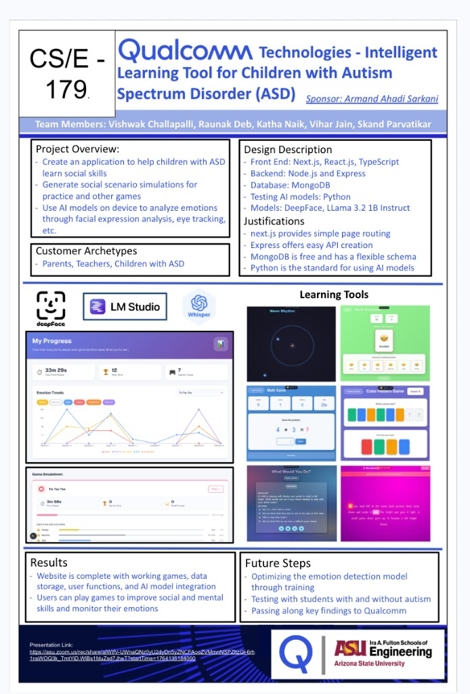
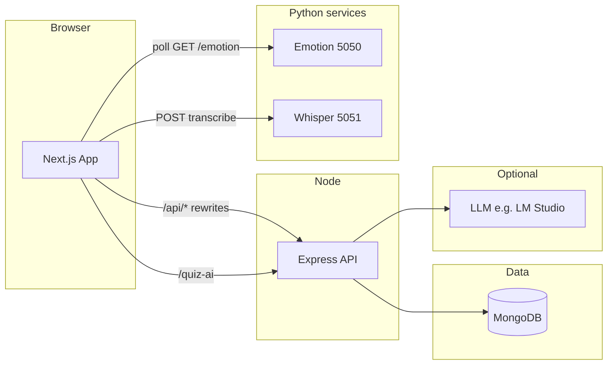

# Qualcomm ASD Platform

An **intelligent learning web application** for children on the autism spectrum: social scenarios, educational mini-games, optional **facial emotion** feedback, **speech-to-text** for read-aloud activities, and **progress analytics** stored per user in **MongoDB**.



---

## Table of contents

**Quick checklist:** [docs/SETUP.md](docs/SETUP.md)

1. [Overview](#overview)
2. [Features](#features)
3. [Architecture](#architecture)
4. [Tech stack](#tech-stack)
5. [Prerequisites](#prerequisites)
6. [Setup guide](#setup-guide)
7. [Running locally](#running-locally)
8. [Using the application](#using-the-application)
9. [Configuration reference](#configuration-reference)
10. [Design & theming](#design--theming)
11. [Optional services](#optional-services)
12. [Production build](#production-build)
13. [Troubleshooting](#troubleshooting)
14. [Project layout](#project-layout)
15. [Scripts](#scripts)
16. [Team, license & changelog](#team-license--changelog)

---

## Overview

The platform combines a **Next.js** front end (games, dashboards, quizzes) with an **Express** API backed by **MongoDB**. Two optional **Python (Flask)** services provide on-device emotion estimation and Whisper-based transcription. An optional **LM Studio** (or any OpenAI-compatible) server powers AI-assisted quiz scenarios.

---

## Features

| Area | Description |
|------|-------------|
| **Landing & auth** | Branded landing (`/page1`), sign up / log in, JWT session cookies via Express |
| **Onboarding** | Avatar and preferences (`/page3`) after signup |
| **Dashboard** | Course and game hub (`/page4`) with navigation and profile |
| **Progress** | Charts and trends (`/page5`) backed by stored game stats |
| **Mini-games** | Math, tic-tac-toe, color pattern, mirror emotions, neon rhythm, astral jump, story reader, etc. under `/games/*` |
| **Emotion monitor** | Global pill UI polling Flask on **5050** (optional) |
| **Story Reader** | Uses Whisper on **5051** for speech input (optional) |
| **Quiz AI** | `/quiz-ai` proxies social scenarios through the API to your configured LLM |

---

## Architecture



**Request path:** Browser calls `http://localhost:3000/api/...`. Next.js **rewrites** those to `http://localhost:5001/...` (Express). The UI also calls Python services **directly** on `127.0.0.1:5050` and `127.0.0.1:5051` where implemented.

---

## Tech stack

| Layer | Technology | Role |
|--------|------------|------|
| Frontend | **Next.js 16**, React 19, TypeScript, Tailwind 4 | UI, routing, games, charts (Recharts), Three.js where used |
| Backend | **Express 5**, Mongoose, cookie-parser | Auth, profiles, `gameProgress`, quiz LLM proxy |
| Database | **MongoDB** | Users, sessions, per-game stats |
| Emotion (optional) | **Flask**, OpenCV, optional ViT / DeepFace / MediaPipe | REST API for games + `EmotionMonitor` |
| Speech (optional) | **Flask**, Whisper, **ffmpeg** | `POST /transcribe` etc. for Story Reader |
| AI quiz (optional) | **LM Studio** or OpenAI-compatible HTTP API | Scenario chat via server env |

---

## Prerequisites

| Requirement | Notes |
|-------------|--------|
| **Node.js** | 18+ recommended (matches Next 16 ecosystem) |
| **npm** | 9+ |
| **MongoDB** | Atlas URI or local instance |
| **Python** | 3.10+ for `emotion-server` and `whisper-server` |
| **ffmpeg** | On `PATH` for Whisper (e.g. `brew install ffmpeg` on macOS) |
| **Webcam** (optional) | For full emotion pipeline; server falls back to **simulated** emotions if the camera is unavailable |
| **LM Studio** (optional) | Local LLM for `/quiz-ai` |

---

## Setup guide

### 1. Clone the repository

```bash
git clone https://github.com/<org-or-user>/Qualcomm-ASD-Platform-.git
cd Qualcomm-ASD-Platform-
```

### 2. Install Node dependencies

From the **repository root**:

```bash
npm install
```

Install **server** dependencies (Express API lives in `server/`):

```bash
cd server && npm install && cd ..
```

### 3. Configure the Express environment

```bash
cp server/.env.example server/.env
```

Edit `server/.env`. See [Configuration reference](#configuration-reference) for every variable.

**Minimum for local auth + database:** `MONGO_URI`, `JWT_SECRET`, and `AUTH_BYPASS=false` (recommended).

### 4. Python — emotion server

```bash
cd emotion-server
python3 -m venv venv
source venv/bin/activate          # Windows: venv\Scripts\activate
pip install -r requirements.txt
deactivate
cd ..
```

Heavy ML stacks (torch, transformers, etc.) are optional. If imports fail, the server can still run in a **lite / simulated** mode for UI testing.

### 5. Python — Whisper server

```bash
cd whisper-server
python3 -m venv venv
source venv/bin/activate
pip install -r requirements.txt
deactivate
cd ..
```

### 6. Verify tooling

```bash
node -v
npm -v
python3 --version
ffmpeg -version    # required for Whisper audio pipelines
```

---

## Running locally

### One command (recommended)

From the **repository root**:

```bash
npm run dev:all
```

Aliases: `npm run devall` or `npm run start:all` (same script).

Starts **in parallel**:

| Service | URL / port |
|---------|------------|
| Next.js (UI + `/api` proxy) | http://localhost:3000 |
| Express API | http://localhost:5001 |
| Emotion Flask | http://127.0.0.1:5050 |
| Whisper Flask | http://127.0.0.1:5051 |

Stop everything with **Ctrl+C** once.

**Shell shortcut (macOS / Linux):**

```bash
chmod +x start-all.sh
./start-all.sh
```

### Run without Python (Next + API only)

```bash
SKIP_PYTHON_SERVERS=1 npm run dev:all
```

### Run services individually (debugging)

| Service | Command (from repo root) |
|---------|--------------------------|
| Next | `npm run dev` |
| API | `node server/index.js` (ensure `server/.env` exists; cwd can be repo root or `server` per your setup) |
| Emotion | `cd emotion-server && ./venv/bin/python server.py` (or `python3 server.py`) |
| Whisper | `cd whisper-server && ./venv/bin/python server.py` |

Express loads `server/.env` via `dotenv` from the `server` directory.

---

## Using the application

| Route | Purpose |
|-------|---------|
| `/` | Redirects to **`/page1`** |
| `/page1` | Landing: **Enter** → sign up, **Log in** → login |
| `/signup`, `/login` | Account creation and session login |
| `/page3` | Post-signup flow (avatar / customization) |
| `/page4` | Main dashboard (games, courses, profile) |
| `/page5` | Progress / analytics views |
| `/games/*` | Individual mini-games and Story Reader |
| `/quiz-ai` | AI-assisted quiz (needs LLM env) |
| `/tests/[contentId]` | Test content routes (if used in your deployment) |

**Theme:** Use the header **theme toggle** where present; light/dark tokens live in `src/app/globals.css` (`[data-theme="dark"]`).

---

## Configuration reference

### `server/.env` (copy from `server/.env.example`)

| Variable | Required | Description |
|----------|----------|-------------|
| `MONGO_URI` | Yes* | MongoDB connection string |
| `PORT` | No | Express port (default **5001**) |
| `JWT_SECRET` | Yes* | Secret for signing auth cookies |
| `AUTH_BYPASS` | No | `true` = skip real auth (demo only). Default **`false`** |
| `LLM_BASE_URL` | For quiz AI | e.g. `http://localhost:1234/v1` |
| `LLM_MODEL` | For quiz AI | Model id in the provider |
| `LLM_API_KEY` | No | Empty for many local servers |
| `LLM_TIMEOUT_MS` | No | Request timeout |
| `LLM_MAX_TOKENS` | No | Cap per completion |
| `LLM_TEMPERATURE` | No | Sampling temperature |
| `LLM_HISTORY_LIMIT` | No | Chat history window |

\*Not required only if you intentionally run with `AUTH_BYPASS=true` and accept limited behavior.

**Cookies:** Auth responses set `secure: true` on cookies. For **HTTPS** deployments this is correct. If you test login over plain `http://localhost` and cookies do not stick, that is a known browser constraint with `Secure` cookies—use HTTPS locally (e.g. reverse proxy) or adjust server cookie options for development only (not committed here by default).

---

## Design & theming

Shared CSS variables are defined in **`src/app/globals.css`**:

- **`--accent`**, **`--accent-rgb`**, **`--accent-bright`** — primary cyan / highlights (links, buttons, emotion UI)
- **`--app-ink`** — deep navy used on the landing page background
- **`--bg`**, **`--surface`**, **`--text-*`**, **`--border`**, etc. — semantic layout colors; dark theme values align with the same navy-forward palette

Dashboard pages (`page4`, `page5`) and auth (`page3` styles for login/signup) consume these tokens for consistent chrome without changing game-specific art direction inside each `/games/*` stylesheet.

---

## Optional services

### LM Studio (quiz AI)

1. Install [LM Studio](https://lmstudio.ai/) and download a small instruct model.
2. Start the local OpenAI-compatible server (often port **1234**).
3. Set `LLM_BASE_URL` and `LLM_MODEL` in `server/.env`.
4. Open **`/quiz-ai`** from the app.

### Emotion server (`5050`)

- **Status:** `GET http://127.0.0.1:5050/status`
- **Current emotion:** `GET http://127.0.0.1:5050/emotion`
- **Browser root:** `GET /` returns a short HTML summary of endpoints.
- **Full model:** needs camera access and Python ML deps; otherwise the process falls back to **simulated** emotions so the UI still responds.

### Whisper server (`5051`)

- Used by Story Reader and similar flows; requires **ffmpeg** and model weights per `whisper-server` README / code.
- **Browser root:** `GET /` describes the API.

---

## Production build

```bash
npm run build
npm start
```

`npm start` runs **Next.js production** on the default port (3000). In production you still need:

- Express (or your host) on **5001** (or change `next.config.ts` rewrites to match).
- MongoDB reachable from the API.
- Optional: emotion and Whisper as separate processes or containers.

Configure your reverse proxy so **`/api/*`** reaches Express if you do not use Next rewrites in production.

---

## Troubleshooting

| Issue | What to do |
|-------|------------|
| **`npm run dev all` does nothing useful** | Use **`npm run dev:all`** (with a **colon**) or `npm run devall`. |
| **Next / Turbopack wrong root** | This repo pins `turbopack.root` in `next.config.ts`. Remove stray `package-lock.json` from a **parent** directory of this repo if the dev server picks the wrong workspace. |
| **`Unable to acquire lock` / Next exits** | Another `next dev` is running or port **3000** is busy. Stop it, or `rm -f .next/dev/lock` from repo root **only when no dev server is running**. |
| **Mongo errors** | Check `MONGO_URI`, Atlas IP allowlist, and network. |
| **Python servers exit** | Ensure `venv` exists in each folder and `pip install -r requirements.txt` succeeded. Use **`SKIP_PYTHON_SERVERS=1`** to run without them. |
| **Whisper / audio fails** | Install **ffmpeg**; verify `ffmpeg -version`. |
| **Port in use** | Free **3000**, **5001**, **5050**, **5051**, or change the relevant server config. |
| **Emotion “not running”** | Open `http://127.0.0.1:5050/status`. Allow webcam if using the full pipeline; otherwise expect **simulated** mode. |
| **404 on `http://127.0.0.1:5051/`** | Whisper is an API; open **`/status`** or the root HTML if implemented. |

---

## Project layout

```
src/app/              # Next.js App Router (pages, games, layouts)
src/components/       # Shared UI (EmotionMonitor, ThemeToggle, charts, ColorBends, …)
src/context/          # ThemeProvider
src/styles/           # CSS modules per page / game
src/lib/              # Client helpers (e.g. session id)
server/               # Express API, Mongoose models, .env
emotion-server/       # Flask emotion API
whisper-server/       # Flask Whisper STT
scripts/dev-all.mjs   # Orchestrates local dev processes
docs/                 # Poster and other static docs
start-all.sh          # Runs npm run dev:all
```

---

## Scripts

| Script | Description |
|--------|-------------|
| `npm run dev` | Next.js dev server only |
| `npm run dev:all` | Next + Express + Emotion + Whisper (unless skipped) |
| `npm run devall` | Same as `dev:all` |
| `npm run start:all` | Same as `dev:all` |
| `npm run build` | Production Next build |
| `npm run start` | Production Next server |
| `npm run lint` | ESLint |

---

## Team, license & changelog

### Team & context

Capstone project (**ASU** — Ira A. Fulton Schools of Engineering, **CSE 179**), sponsored by **Qualcomm** (Armand Ahadi Sarkani).

Team: **Vishwak Challapalli**, Raunak Deb, Katha Naik, Vihar Jain, Skand Parvatikar.

### License

Private / course use unless otherwise specified by the team and sponsor.

### Changelog (documentation / product updates)

Use this section in GitHub releases or PR descriptions; keep newest first.

| Date | Summary |
|------|---------|
| **2026-04** | **Docs:** Expanded README (setup, config, routes, troubleshooting, production). **Theming:** Shared CSS variables (`--accent`, `--app-ink`, dark palette) in `globals.css`; dashboard and auth styles aligned. **Landing:** ColorBends background, Playfair hero type, centered CTA, `dev:all` orchestration, Turbopack root fix. **Auth:** `AUTH_BYPASS` defaults off; `/api/me` 401 redirects to login on protected pages. **Emotion:** Camera / cascade failure falls back to simulation; `/status` includes error hints. **Removed:** Legacy admin static site and related scripts. |

---

### Poster asset

If `docs/poster.png` is missing in your clone, add your team poster to **`docs/poster.png`** or remove the image line at the top of this README.
